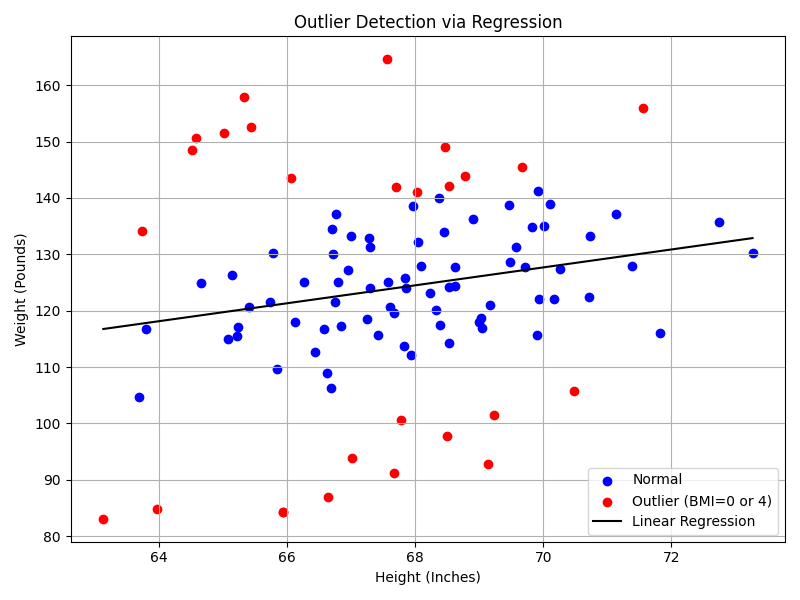

# Homework 3: BMI Data Analysis (Essential Steps)

## 1. Dataset Overview

We use an Excel dataset `bmi_data_phw3.xlsx` with the following key variables:

- `Height (Inches)` – individual's height
- `Weight (Pounds)` – individual's weight
- `BMI` – categorical BMI label (0–4)
- `Sex` – gender (Male/Female)

---

## 2. Data Exploration

### Data Info
Checked column types, null counts, and value ranges using:
```python
df.info(), df.describe(), df.dtypes
```

---

## 3. BMI Conversion for Categorical Plots

Converted the `BMI` column from int to string to use as a categorical label in plots.

---

## 4. Height Distribution by BMI

Height distribution is plotted across different BMI categories using histogram + facet grid.

**Saved as**: `height_hist_by_bmi.png`


---

## 5. Weight Distribution by BMI

Similar facet grid for weight distribution by BMI category.

**Saved as**: `weight_hist_by_bmi.png`


---

## 6. Feature Scaling Comparison

Used three types of scaling methods to compare how height and weight distributions change:

| Scaler        | Description                  |
|---------------|------------------------------|
| StandardScaler | z-score normalization        |
| MinMaxScaler   | scales features between 0–1  |
| RobustScaler   | median & IQR (outlier robust)|

Height Scaling Plots:
- `standard_height_scaled.png`
- `minmax_height_scaled.png`
- `robust_height_scaled.png`

Weight Scaling Plots:
- `standard_weight_scaled.png`
- `minmax_weight_scaled.png`
- `robust_weight_scaled.png`

Each image shows histogram + KDE for scaled features.

---

## 7. Regression and Normalized Error (ze)

Performed linear regression:

```
Weight = a * Height + b
```

Calculated residuals and normalized them to compute:

```
ze = (error - mean(error)) / std(error)
```

Used for outlier detection.

---

## 8. ze Histogram

Histogram of normalized errors with `alpha = ±1.0` thresholds:

**Saved as**: `ze_histogram.png`


---

## 9. Outlier Classification Rule

- `ze < -1.0` → BMI = 0
- `ze > +1.0` → BMI = 4
- otherwise → Normal

---

## 10. Scatter Plot with Outliers

- Blue: normal data
- Red: outliers (BMI = 0 or 4)
- Black line: regression

**Saved as**: `scatter_outlier_regression.png`



---

## 11. Gender-Based Regression

Separate models trained for each gender group:

```python
Female model: weight = a_female * height + b_female  
Male model:   weight = a_male   * height + b_male
```

Printed result:
```
Female model: weight = [slope_f] * height + [intercept_f]
Male model:   weight = [slope_m] * height + [intercept_m]
```

---

## 12. Summary

| Step            | Description                           |
|------------------|---------------------------------------|
| Cleaning         | Handled BMI types and invalid values  |
| Visualization    | Distribution by BMI category          |
| Scaling          | Compared 3 different scalers          |
| Regression       | Predicted weight from height          |
| Error analysis   | Used ze to detect outliers            |
| Gender modeling  | Compared male/female regression lines |

---

## 13. Files Generated

- `lab3_phw3.py` (script)
- `figures-hw/*.png` (figures)

