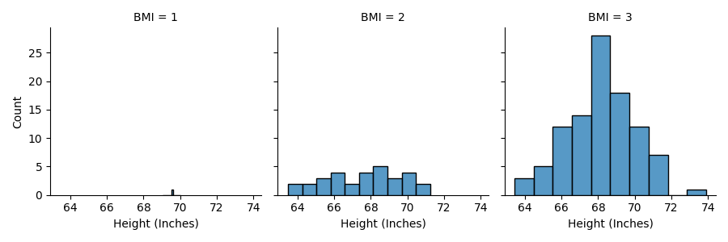
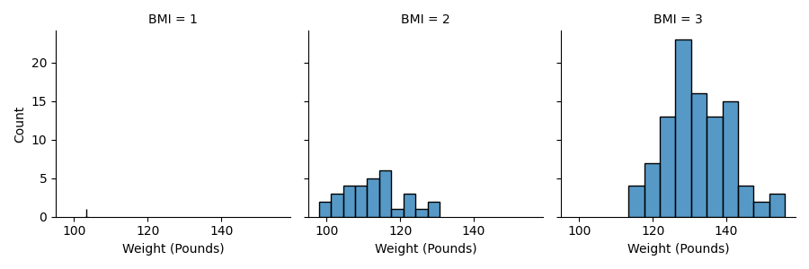
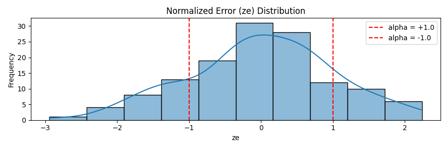
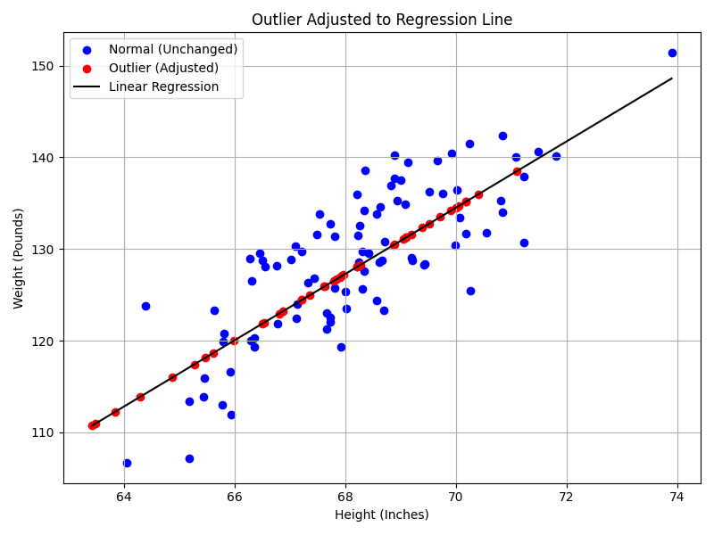

# Lab 3: Regression-Based Outlier Detection using BMI Dataset

## 1. Dataset Description

We use a dataset containing the following columns:

- `Height (Inches)` — individual's height  
- `Weight (Pounds)` — individual's weight  
- `BMI` — body mass index category (integer between 0–4)  
- `Sex` — individual's gender (`Male`, `Female`)

---

## 2. Data Cleaning

To remove invalid or extreme values:

- Heights below 50 or above 84 inches → set as NaN  
- Weights below 50 or above 300 pounds → set as NaN  
- BMI values not in the range [0, 4] → set as NaN  

Rows with missing values are dropped. The cleaned dataset is used for all analyses.

---

## 3. Height Histogram by BMI

Each BMI category shows the distribution of height.

**Saved as**: `figures-lab/height_hist_by_bmi.png`  


---

## 4. Weight Histogram by BMI

Each BMI category shows the distribution of weight.

**Saved as**: `figures-lab/weight_hist_by_bmi.png`  


---

## 5. Linear Regression & Normalized Error (ze)

A linear regression model is trained:

- Input (`X`): Height (in inches)  
- Output (`y`): Weight (in pounds)  

Then we calculate the normalized error for each point:

```text
ze = (e - mean(e)) / std(e)
```

where `e = y - y_pred`.

**Saved as**: `figures-lab/ze_histogram.png`  


---

## 6. Outlier Detection & Correction

Outliers are defined as:

- `ze < -1.0` → significantly below the regression line  
- `ze > +1.0` → significantly above the regression line  

Outliers are corrected by projecting them onto the regression line:

```text
corrected_weight = slope * height + intercept
```

**Blue dots** = Normal values (unchanged)  
**Red dots** = Outliers adjusted to the regression line

**Saved as**: `figures-lab/scatter_outlier_regression_adjusted.png`  


---

## 7. Feature Scaling Visualization

The adjusted dataset is scaled using three techniques:

- `StandardScaler`
- `MinMaxScaler`
- `RobustScaler`

Each scaled result is visualized:

- `figures-lab/standardscaler_height_weight.png`  
- `figures-lab/minmaxscaler_height_weight.png`  
- `figures-lab/robustscaler_height_weight.png`

---

## 8. Gender-Based Regression

Separate linear regressions are performed for `Female` and `Male` groups.

Each model fits a line of the form:

```text
weight = slope * height + intercept
```

This shows how the height-weight relationship differs by gender.
